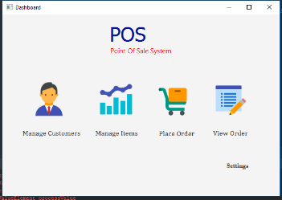
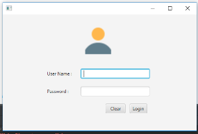
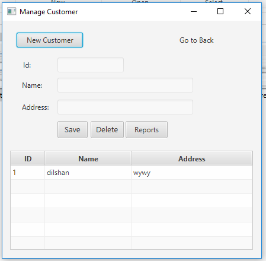
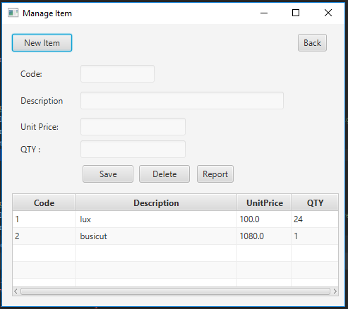
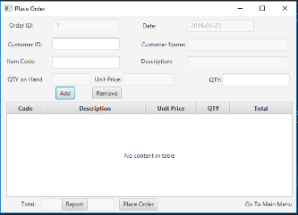
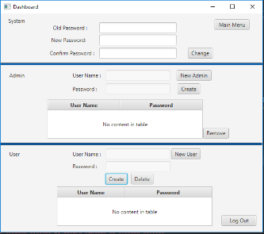

# Point-of-Sale-In-Memory-DB-
Point of Sale System
In this POS SYSTEM has all the fucnctionalities of a pos system.
customer adding,item management,order placing and order viewing. It has inbuild memory.

It Consist of four main parts;

    * Login 
    * Manage Customers
    * Manage Items
    * Place orders
    * View Orders
    
## POS SYSTEM Main Menu
 

## Login
 

## Customer Page 
 

## Item Page

## Place Order Page

## User Login Setting
 
